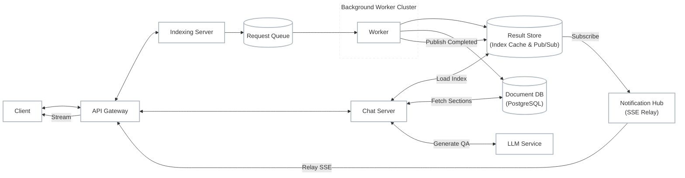
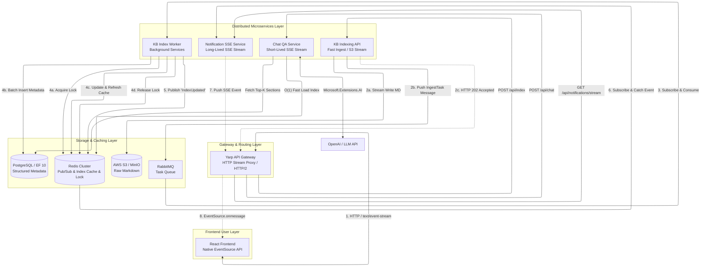
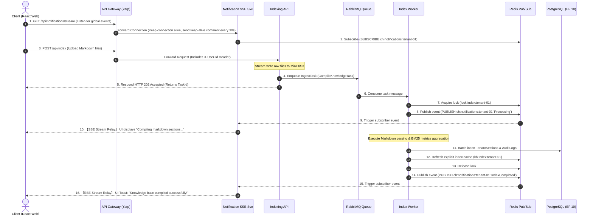
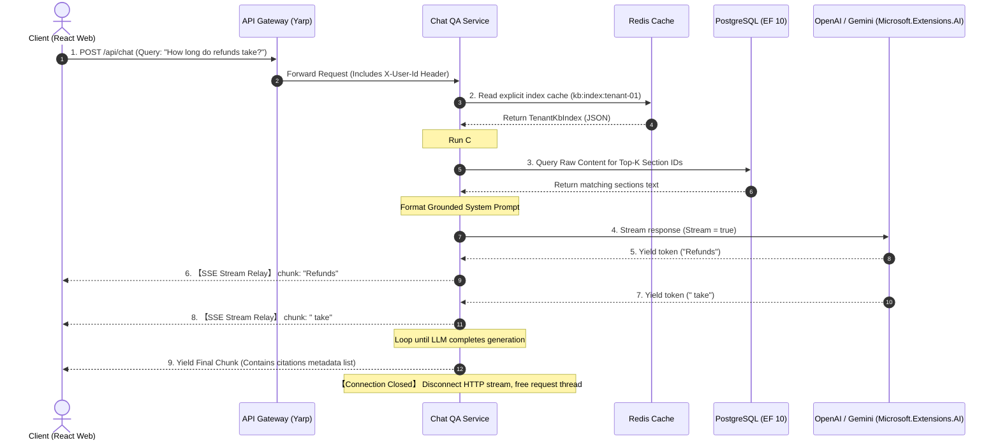

# Project Cloud-KB: Distributed Multi-Tenant Markdown Knowledge Base System (.NET 10 Enterprise)

This project is a cloud-native, distributed, multi-tenant AI retrieval and question-answering system (RAG) built on the **.NET 10 / .NET Aspire 10** ecosystem. The architecture implements Andrej Karpathy's **LLM Wiki Pattern (compile knowledge at write-time, explicit index navigation)**. It adopts native **Server-Sent Events (SSE) streaming**, decoupled via **RabbitMQ task queues** and **Redis Pub/Sub** to achieve high-throughput, low-latency multi-tenant knowledge compilation and grounded QA microservices.

---

## 1. High-Level Design Concept (HLD)

Before examining the microservice topology, below is the conceptual diagram of the asynchronous task processing architecture:



---

## 2. Microservice Architecture (System Architecture)

This project uses **.NET Aspire 10** as the distributed application orchestrator (App Host) to coordinate services, telemetry, and connection strings. The microservice topology is detailed below:



---

## 3. Component Walkthrough (.NET Aspire 10 Ecosystem)

### 3.1 Infrastructure & Orchestration (AppHost)

* **`CloudKB.AppHost`**: The central orchestrator. Configures service discovery, injects environment variables, manages container dependencies (Redis, PostgreSQL, RabbitMQ, MinIO), and establishes named data volumes to achieve persistence.
* **`CloudKB.ServiceDefaults`**: Configures global OpenTelemetry (Metrics, Tracing, Logging), health checks, and .NET 10 resiliency policies (such as Polly circuit breakers and retry logic).

### 3.2 Microservice Compute Layer

* **`CloudKB.Gateway` (Yarp)**: The反向代理 (reverse proxy) gateway. Validates JWT tokens and injects user identity as an `X-User-Id` header to downstream services. It supports HTTP/2 and HTTP/3 multiplexing, allowing multiple client-side SSE streams to share a single TCP connection.
* **`CloudKB.ApiService.Indexing`**: A lightweight file ingestion controller. Receives Markdown files, streams them to MinIO/S3 storage, pushes a tasks payload to RabbitMQ, and immediately responds with `202 Accepted` to free incoming threads.
* **`CloudKB.Worker.Indexer`**: A background indexing worker (`BackgroundService`). Asynchronously consumes RabbitMQ tasks, parses Markdown headings, calculates BM25 term frequencies, and updates Postgres and Redis under a distributed lock (`lock:index:{tenantId}`).
* **`CloudKB.ApiService.Notification`**: The **Global Long-Lived Notification Service**. Maintains a persistent SSE connection (`GET /api/notifications/stream`) with logged-in clients. It subscribes to Redis Pub/Sub channels and streams index compilation progress alerts to the client.
* **`CloudKB.ApiService.Chat`**: The **Short-Lived Chat Service**. Handles RAG QA requests. It fetches the lightweight explicit index from Redis to calculate C# In-Memory BM25 scores. If query correlation passes the threshold, it retrieves the section texts from Postgres, compiles a grounded prompt, streams typewriter tokens using `Microsoft.Extensions.AI` and `IAsyncEnumerable<T>`, and closes the HTTP connection once final citations are sent.

### 3.3 Storage & Caching Layer

* **Blob Storage (MinIO / S3)**: Stores raw Markdown files under the path structure `/{user_id}/raw/*.md`.
* **PostgreSQL (Entity Framework Core 10)**: Stores structured metadata, including `TenantSection` text fragments, heading breadcrumbs, file states, and indexing logs.
* **Redis Cluster**:
  - **`kb:index:{user_id}`**: Caches compiled tenant BM25 explicit indexes (JSON format). If a cache miss occurs, the Chat service automatically reloads records from Postgres to restore this cache.
  - **`lock:index:{user_id}`**: A distributed lock preventing write race-conditions during concurrent uploads.
  - **Pub/Sub Channel (`ch:notifications:{user_id}`)**: Message broker channel relaying indexing progress and completion events from workers to notification services.

---

## 4. Core Data Models

### 4.1 Structured Section Entity (PostgreSQL / EF 10)

```csharp
public class TenantSection
{
    public string Id { get; set; } = null!; // Composite PK: {user_id}#{filename}#{slugified-heading}
    public string TenantId { get; set; } = null!;
    public string FileName { get; set; } = null!;
    public string Heading { get; set; } = null!;
    public List<string> HeadingPath { get; set; } = new();
    public string Content { get; set; } = null!;
    public List<string> Tokens { get; set; } = new();
    public int TokenCount { get; set; }
    public DateTime CreatedAt { get; set; } = DateTime.UtcNow;
    public DateTime UpdatedAt { get; set; } = DateTime.UtcNow;
}
```

### 4.2 SSE Event Contract Formats (JSON Payloads)

```csharp
// Global notification event channel (GET /api/notifications/stream)
public record NotificationEvent(
    string EventType,        // e.g., "IndexProcessing", "IndexCompleted"
    string TaskId,           // Task ID
    string Message,          // Alert message
    object? Metadata         // Additional metadata (e.g. sectionsCompiled count)
);

// Chat streaming event channel (POST /api/chat)
public record ChatStreamChunk(
    string Text,             // Generated token text
    bool IsFinal,            // True if this is the final chunk
    List<SourceCitation>? Sources // Citation list when IsFinal == true
);
```

---

## 5. Distributed Operations Workflows

### 5.1 Async Ingestion & Global SSE Notification Stream



### 5.2 Grounded QA Chat & Short-Lived SSE Responses



---

## 6. Technology Stack Selection

* **Orchestration & Service Mesh**: .NET Aspire 10 (Service discovery, distributed tracing, OpenTelemetry dashboard)
* **Reverse Proxy Gateway**: Yarp Reverse Proxy (Multiplexed HTTP/2 streaming proxy)
* **Backend Framework**: ASP.NET Core 10 (Minimal APIs, Worker Service, Native AOT compatible)
* **Real-time Streaming**: Server-Sent Events (SSE), C# `IAsyncEnumerable<T>`
* **Task Queues**: RabbitMQ (Asynchronous background task runner decoupled via events)
* **Caching & Broker Middleware**: StackExchange.Redis (Index key-value cache, distributed locking, Pub/Sub channels)
* **AI Unified Abstraction**: Microsoft.Extensions.AI
* **Database & ORM**: Entity Framework Core 10 (PostgreSQL database provider, Bulk operations optimized)
* **Frontend Web Application**: React (Vite + TypeScript), native browser `EventSource` API, Tailwind CSS
