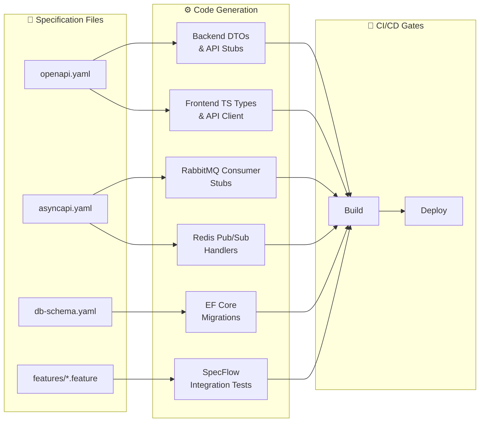

# Cloud-KB — Spec-Driven Development (SDD) Specifications

This directory contains the **machine-readable specification files** that drive the entire Cloud-KB development lifecycle. Every API endpoint, async message, database entity, and acceptance test is defined here as a single source of truth.

> **Philosophy:** Code is generated from specs, not the other way around.
> When a spec changes, tooling detects drift and CI/CD fails until code is realigned.

---

## Directory Structure

```
specs/
├── README.md                          # ← You are here
├── openapi.yaml                       # 1. Synchronous HTTP API contracts
├── asyncapi.yaml                      # 2. Async messaging & event contracts
├── db-schema.yaml                     # 3. Database entity & migration spec
├── tokenizer-spec.md                  # 5. Tokenisation and text normalisation spec
├── sse-protocol.md                    # 6. SSE line-by-line wire format spec
├── aspire-topology.yaml               # 7. .NET Aspire 10 topology & service discovery
├── appsettings.schema.json            # 8. AppSettings JSON Schema for configuration
├── features/                          # 4. BDD acceptance test specifications
│   ├── feature-1-gateway-auth.feature
│   ├── feature-2-async-ingest.feature
│   ├── feature-3-knowledge-compilation.feature
│   ├── feature-4-notification-stream.feature
│   ├── feature-5-chat-gateway.feature
│   ├── feature-6-chat-qa-engine.feature
│   ├── feature-7-health-check.feature
│   └── feature-8-frontend.feature
└── tasks/                             # 9. Agent implementation task guides
    ├── README.md
    ├── milestone-0-foundation/
    │   └── task-0-foundation.md
    ├── milestone-1-read-pipeline/
    │   ├── task-6-chat-qa-engine.md
    │   ├── task-5-chat-gateway.md
    │   └── task-7-health-check.md
    └── milestone-2-write-pipeline/
        ├── task-1-gateway-auth.md
        ├── task-2-async-ingest.md
        ├── task-3-knowledge-compilation.md
        ├── task-4-notification-stream.md
        └── task-8-frontend.md
```

---

## 1. OpenAPI Specification (`openapi.yaml`)

| Attribute | Value |
|-----------|-------|
| **Spec Version** | OpenAPI 3.1.0 |
| **Scope** | All synchronous HTTP endpoints (Gateway → Microservices) |
| **Endpoints** | `GET /health`, `POST /api/index`, `POST /api/chat`, `GET /api/notifications/stream` |

### Automation Targets

| Consumer | Tool | Output |
|----------|------|--------|
| Backend (.NET 10) | `Microsoft.AspNetCore.OpenApi` | Minimal API endpoint stubs, strong-typed Request/Response DTOs |
| Frontend (React) | `openapi-typescript` / `orval` | TypeScript types + Axios/Fetch API client functions |
| Gateway (Yarp) | Custom route generator | Proxy route configuration from path definitions |
| Documentation | Swagger UI / Redoc | Interactive API explorer |

### Quick Validation

```bash
# Validate spec syntax
npx @redocly/cli lint specs/openapi.yaml

# Generate TypeScript client
npx openapi-typescript specs/openapi.yaml -o src/api/schema.d.ts
```

---

## 2. AsyncAPI Specification (`asyncapi.yaml`)

| Attribute | Value |
|-----------|-------|
| **Spec Version** | AsyncAPI 3.0.0 |
| **Scope** | RabbitMQ task queues + Redis Pub/Sub channels + Redis cache keys |
| **Channels** | `cloudkb.indexing.compile`, `ch:notifications:{tenantId}`, `lock:index:{tenantId}`, `kb:index:{tenantId}` |

### Automation Targets

| Consumer | Tool | Output |
|----------|------|--------|
| Index Worker | AsyncAPI Generator (.NET template) | RabbitMQ consumer stubs with typed message classes |
| Notification Service | AsyncAPI Generator | Redis Pub/Sub subscriber handlers |
| Documentation | AsyncAPI Studio | Interactive event catalog |

### Quick Validation

```bash
# Validate spec syntax
npx @asyncapi/cli validate specs/asyncapi.yaml

# Generate documentation
npx @asyncapi/cli generate fromTemplate specs/asyncapi.yaml @asyncapi/html-template -o docs/async-api/
```

---

## 3. Database Schema Specification (`db-schema.yaml`)

| Attribute | Value |
|-----------|-------|
| **Format** | YAML entity definitions with EF Core 10 Fluent API reference |
| **Database** | PostgreSQL 16+ |
| **Entities** | `TenantSection`, `IndexCompilationJob`, `TenantFile` |
| **Multi-Tenant Strategy** | Row-level isolation via `tenant_id` column + B-Tree indexes |

### Automation Targets

| Consumer | Tool | Output |
|----------|------|--------|
| Backend (.NET 10) | EF Core Migrations | PostgreSQL DDL (CREATE TABLE, indexes, constraints) |
| CI/CD Pipeline | `dotnet ef migrations has-pending-model-changes` | Schema drift detection |

### Quick Commands

```bash
# Generate migration
dotnet ef migrations add <MigrationName> -p CloudKB.Infrastructure -s CloudKB.AppHost

# Apply migration
dotnet ef database update -p CloudKB.Infrastructure -s CloudKB.AppHost

# CI gate: check for pending changes
dotnet ef migrations has-pending-model-changes -p CloudKB.Infrastructure -s CloudKB.AppHost
```

---

## 4. BDD Acceptance Tests (`features/*.feature`)

| Attribute | Value |
|-----------|-------|
| **Format** | Gherkin (Cucumber / SpecFlow syntax) |
| **Coverage** | All 8 Features across Epics 1, 2 & 3 |
| **Total Scenarios** | 45+ acceptance criteria |

### Feature-to-File Mapping

| Feature | File | Key Scenarios |
|---------|------|---------------|
| F1: Gateway Auth | `feature-1-gateway-auth.feature` | JWT validation, tenant injection, HTTP/2 mux |
| F2: Async Ingest | `feature-2-async-ingest.feature` | S3 streaming, RabbitMQ enqueue, 202 fast-return |
| F3: Knowledge Compilation | `feature-3-knowledge-compilation.feature` | Distributed lock, Markdown parsing, BM25 stats |
| F4: Notification Stream | `feature-4-notification-stream.feature` | Long-lived SSE, Redis Pub/Sub relay, keep-alive |
| F5: Chat Gateway | `feature-5-chat-gateway.feature` | Chat routing, query validation, concurrency |
| F6: Chat QA Engine | `feature-6-chat-qa-engine.feature` | BM25 retrieval, early exit, grounded SSE stream |
| F7: Health Check | `feature-7-health-check.feature` | Gateway liveness probe, downstream microservices local probe |
| F8: Frontend UI | `feature-8-frontend.feature` | Tenant login, drag-and-drop markdown upload, file list view, streaming markdown chat with citations |


### Automation Targets

| Consumer | Tool | Output |
|----------|------|--------|
| .NET 10 Test Project | xUnit + SpecFlow | Auto-generated integration test classes |
| CI/CD Pipeline | `dotnet test` | Pass/fail gate — spec drift = build failure |

### Quick Commands

```bash
# Run all BDD tests
dotnet test --filter "Category=BDD"

# Run specific feature
dotnet test --filter "Category=feature-6"
```

---

## SDD Workflow Summary



> **Key Principle:** When any spec file changes, the corresponding generated
> code and tests automatically detect the drift. CI/CD blocks deployment
> until all consumers are realigned with the updated specification.

---

## 5. Tokenisation and Text Normalisation (`tokenizer-spec.md`)

Defines the exact deterministic text pre-processing rules (lowercasing, punctuation stripping, word splitting, and standard 50-word stopword filtering). Essential for guaranteeing identical BM25 score outputs in C# backend implementation and BDD integration tests.

## 6. SSE Line-by-Line Wire Protocol (`sse-protocol.md`)

Documents the raw line protocol for Server-Sent Events, detailing the connection lifecycles, event names (`IndexProcessing`, `IndexCompleted`, `IndexFailed`), custom heartbeat pings (`:ping\n\n`), and client-side stream parser templates.

## 7. .NET Aspire 10 Topology & Service Discovery (`aspire-topology.yaml`)

Specifies container image registers, database schemas, local bindings, environment variable keys, and resource dependencies orchestrated via .NET Aspire 10. Downstream microservices use this spec for uniform HTTP service discovery.

## 8. AppSettings Configuration Schema (`appsettings.schema.json`)

A draft-2020-12 JSON Schema for validating the configuration entries inside `appsettings.json` (such as BM25 parameters $k_1$ and $b$, early-exit threshold values, OpenAI models, and storage bucket settings).

## 9. Agent Implementation Tasks (`tasks/`)

Step-by-step task files for AI Agents to implement the system using SDD. Tasks are ordered across 3 milestones:

| Milestone | Scope | Tasks |
| :-------- | :---- | :---- |
| **M0 — Foundation** | Aspire AppHost, DB schema, shared tokeniser, BM25 engine | Task 0 |
| **M1 — Read Pipeline (Epic 2)** | Chat QA engine + Chat gateway + Health check probes | Task 6 → Task 5 → Task 7 |
| **M2 — Write Pipeline (Epic 1 & 3)** | Full gateway auth, async ingest, compilation worker, notification SSE, React UI | Task 1 → Task 2 → Task 3 → Task 4 → Task 8 |

Each task file references the relevant spec files and BDD feature files, provides implementation steps with code samples, and lists verification criteria. See [tasks/README.md](./tasks/README.md) for the full dependency graph and execution guide.


