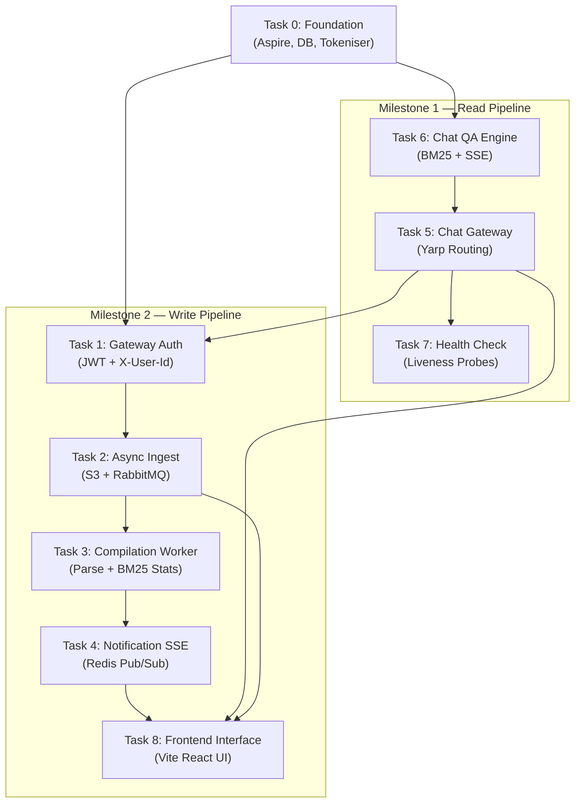

# Cloud-KB — Agent Task Specifications

This directory contains ordered, step-by-step task files designed to guide AI Agents through implementing the Cloud-KB system using **Spec-Driven Development (SDD)**.

Each task file tells an Agent:
1. **What to build** — referencing the Feature spec in `docs/`
2. **How to build it** — referencing the machine-readable contracts in `specs/`
3. **How to verify it** — referencing the BDD Gherkin scenarios in `specs/features/`

---

## Milestone Ordering

> **Key Decision:** Epic 2 (Read Pipeline) is implemented first as **Milestone 1** because it delivers immediate end-user value (ask questions, get answers) and has fewer infrastructure dependencies. Epic 1 (Write Pipeline) follows as **Milestone 2**, adding the full async ingestion, compilation, and notification capabilities.

---

## Task Execution Order

### Milestone 0 — Foundation & Shared Infrastructure

| Task | File | Description |
| :--- | :--- | :---------- |
| **Task 0** | [task-0-foundation.md](./milestone-0-foundation/task-0-foundation.md) | .NET Aspire AppHost, DB schema, shared tokenizer, ServiceDefaults |

> **Why a Milestone 0?** Both Milestones 1 and 2 depend on PostgreSQL entities, Redis cache structures, the shared tokeniser, and the Aspire orchestrator. Building this foundation first prevents duplication and ensures all downstream services share the same contracts.

---

### Milestone 1 — The Read Pipeline (Epic 2)

| Order | Task | File | Feature | Depends On |
| :---: | :--- | :--- | :------ | :--------- |
| 1 | **Task 6** | [task-6-chat-qa-engine.md](./milestone-1-read-pipeline/task-6-chat-qa-engine.md) | Feature 6: In-Memory BM25 + Grounded SSE | Task 0 |
| 2 | **Task 5** | [task-5-chat-gateway.md](./milestone-1-read-pipeline/task-5-chat-gateway.md) | Feature 5: Chat Gateway Routing | Task 0, Task 6 |
| 3 | **Task 7** | [task-7-health-check.md](./milestone-1-read-pipeline/task-7-health-check.md) | Feature 7: System-Wide Health Check Endpoint | Task 0, Task 5 |

> **Implementation order rationale:** Task 6 (the core QA engine) is built first because it is the innermost service with the most complex logic. Task 5 (the gateway routing layer) wraps Task 6. Task 7 (health checks) is added to expose service liveness.

---

### Milestone 2 — The Write Pipeline (Epic 1 & 3)

| Order | Task | File | Feature | Depends On |
| :---: | :--- | :--- | :------ | :--------- |
| 4 | **Task 1** | [task-1-gateway-auth.md](./milestone-2-write-pipeline/task-1-gateway-auth.md) | Feature 1: Full Gateway Auth & Isolation | Task 0, Task 5 |
| 5 | **Task 2** | [task-2-async-ingest.md](./milestone-2-write-pipeline/task-2-async-ingest.md) | Feature 2: Async File Ingestion | Task 0, Task 1 |
| 6 | **Task 3** | [task-3-knowledge-compilation.md](./milestone-2-write-pipeline/task-3-knowledge-compilation.md) | Feature 3: Knowledge Compilation Worker | Task 0, Task 2 |
| 7 | **Task 4** | [task-4-notification-stream.md](./milestone-2-write-pipeline/task-4-notification-stream.md) | Feature 4: Notification SSE Stream | Task 0, Task 3 |
| 8 | **Task 8** | [task-8-frontend.md](./milestone-2-write-pipeline/task-8-frontend.md) | Feature 8: Frontend Interface (React UI) | Task 2, Task 4, Task 5 |

> **Implementation order rationale:** Task 1 extends the existing gateway. Tasks 2→3→4 follow the data flow: upload → compile → notify. Task 8 wraps all capabilities (read, write, notifications) into a single-page application dashboard.

---

## Dependency Graph

---

## How an Agent Should Use These Tasks

1. **Check and Update [sdd_checklist.md](./sdd_checklist.md)**: Look at the master checklist to identify the current active/completed milestones and locate the next pending task.
2. **Sync the Progress**: UPDATES the PROCESSING and COMPLETED task accordingly when working on tasks.
3. **Read the task file** for the current step.
4. **Read all referenced spec files** listed in the `## SDD Spec References` section of the task.
5. **Implement** following the step-by-step instructions in `## Implementation Steps`.
6. **Verify** by running the commands and checking the BDD scenarios listed in `## Verification`.
7. **Mark the task as completed [x]** in [sdd_checklist.md](./sdd_checklist.md) and move to the next task only after all verification criteria pass.
